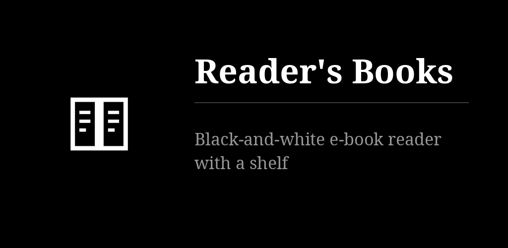
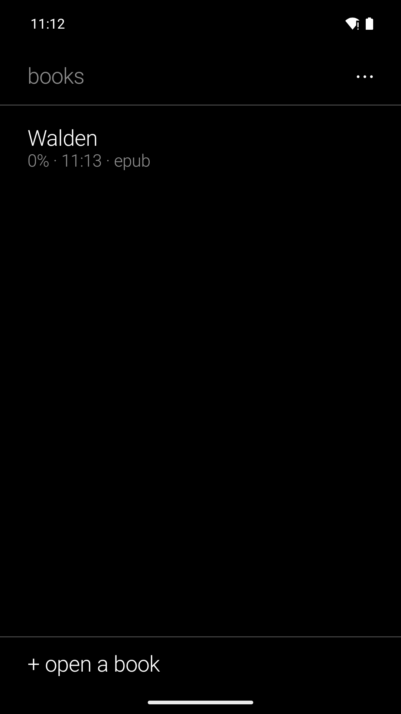

# Reader's Books

A shelf as a plain list; books as pages of text cut at whole lines, turned by a tap — made
for e-ink. EPUB, MOBI, FB2, TXT; the place in each book is kept. No store, no account, no
network permission. It extends the built-in reader of
[Reader's Launcher](https://github.com/funkypitt/readers-launcher) into a shelf.

## Key points

* The shelf lists title, how far you are, when you last opened it. Tap to read.
* The right half of the screen turns forward, the left half back. Long press opens the menu:
  chapters, larger or smaller text, back to the shelf, remove.
* Add a book from the shelf, from a file manager ("open with"), or by sharing the file to the
  app. Books are copied into the app, so the original can move.
* The position is kept per book and survives a change of text size or screen. The screen
  stays on while a page is open, until fifteen minutes after the last turn.
* Pictures in EPUBs are shown in the page, scaled to the text width and never cut; styles and
  footnote links are dropped. MOBI means PalmDoc; no PDF.
* A magazine issue (an EPUB whose contents page carries a section, a title and an author per
  article, as the newspapers pipeline writes them) opens on its contents: sections, titles,
  authors and cover pictures. An article is a chapter; back returns to the contents.
* One home-screen widget for any launcher: the book being read and the position; tap carries
  on at the current page. The launcher's book tile shows the same.

## Install

- **F-Droid** (recommended, updates arrive by themselves): add the repository from [gallaz.ch/eink](https://gallaz.ch/eink/#fdroid), or the address `https://funkypitt.github.io/fdroid-repo/repo` in F-Droid.
- **Obtainium**: tap the badge on the phone, or add `https://github.com/funkypitt/readers-books` in Obtainium.
- **APK**: attached to the [latest release](../../releases/latest). No automatic updates.

All three deliver the same file, with the same signature.

## Build

`./gradlew assembleDebug` (JDK 17+, Android SDK 35).

## Crédits / Credits

© 2026 Pierre Gallaz. Développé avec [Claude Code](https://claude.com/claude-code) (Anthropic).
Licence MIT, voir `LICENSE`.

© 2026 Pierre Gallaz. Developed with [Claude Code](https://claude.com/claude-code) (Anthropic).
MIT licence, see `LICENSE`.

## Captures d'écran

 
